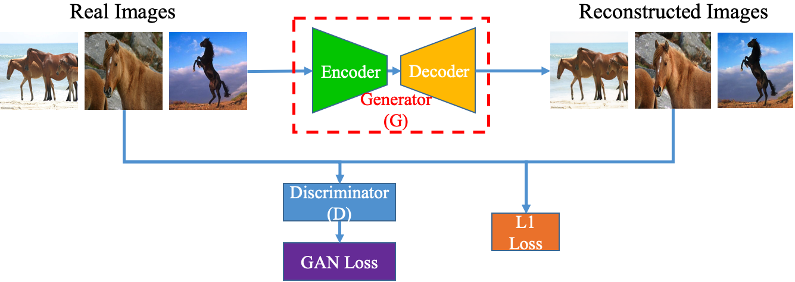
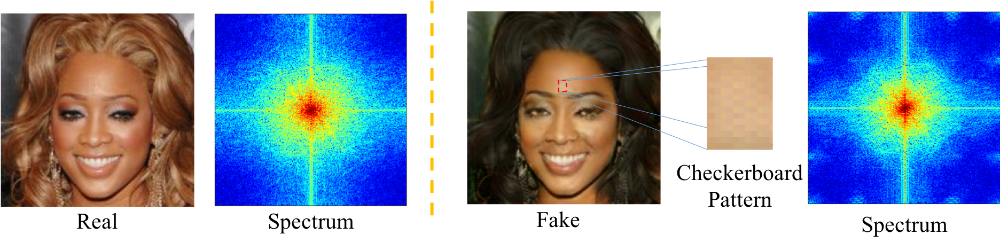
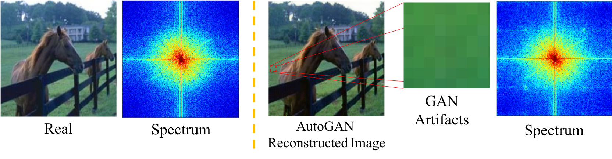

# Detecting and Simulating Artifacts in GAN Fake Images

##Introduction
To detect GAN generated images, conventional supervised machine learning algorithms require collection of a number of real and fake images from the targeted GAN model. However, the specific model used by the attacker is often unavailable. 

To address this, we propose a GAN simulator, AutoGAN, which can simulate the artifacts produced by the common pipeline shared by several popular GAN models.

<p align="center">
  
</p>
<p align="center">
  AutoGAN Pipeline
</p>


 
Additionally, we identify a unique artifact caused by the up-sampling component included in the common GAN pipeline. We show theoretically such artifacts are manifested as replications of spectra in the frequency domain and thus propose a classifier model based on the spectrum input, rather than the pixel input. 
<p align="center">
  
</p>
<p align="center">
  Upsampling artifacts in StarGAN image
</p>

By using the simulated images to train a spectrum based classifier, even without seeing the fake images produced by the targeted GAN model during training, our approach achieves state-of-the-art performances on detecting fake images generated by popular GAN models such as CycleGAN. 

<p align="center">
  
</p>
<p align="center">
  Upsampling artifacts in AutoGAN image
</p>

This code is the training and evaluation code for our WIFS 2019 paper ([arxiv](https://arxiv.org/pdf/1907.06515v2.pdf)).

@inproceedings{zhang2019detecting,<br />
  title={Detecting and Simulating Artifacts in GAN Fake Images},<br />
  author={Zhang, Xu and Karaman, Svebor and Chang, Shih-Fu},<br />
  booktitle={WIFS},<br />
  year={2019}<br />
}

## Installation 

Make a full clone to make sure cloning all the submodules.

```bash
git clone --recursive git@github.com:ColumbiaDVMM/AutoGAN.git
```

My current conda environment is attached as [AutoGAN.yml](conda/AutoGAN.yml)

## Data Preparation
Download cycleGAN image data. 

```bash
# From project directory
cd autogan
python datasets/prepare_data.py
```

Download cycleGAN model.
 
```bash
# From project directory
cd autogan
python scripts/prepare_model.py
```

Run cycleGAN to get all cycleGAN synthesized images.

```bash
# From project directory
cd autogan
python run_test.py --dataset CycleGAN
```

### AutoGAN Extra Preparation:
Train all autoGAN models (this may take 2-3 days):

```bash
# From project directory
cd autogan
python run_training.py
```
To train cityscapes and maps models, change make trainB directory under datasets/cityscapes or datasets/maps with any jpg images. Remove it once training is done. Once training is done, change all the autogan models' name in ./autogan/checkpoints/{category}\_auto/latest\_net\_G\_A.pth to ./autogan/checkpoints/{category}\_auto/latest\_net\_G.pth

Pretrained model can be downloaded from [Google Drive](https://drive.google.com/open?id=1IZZ5QCLbzAmrPDHh7EdOigPCdz46zPc6). Unzip to ./autogan/checkpoints/

Run autoGAN to get all autoGAN synthesized images.

```bash
# From project directory
cd autogan
python run_test.py --dataset AutoGAN
```
### Leave-One-Out Extra Preparation (Optional):

```bash
# From project directory
cd autogan/datasets
python get_fold_information.py 
```

## Training and Test GAN Detection Classifier
### Training
The easiest way to train the classifier on **all 13 semantic categories** (You may change the code to run with less categories) is

```bash
# From project directory
python run_training.py --dataset=CycleGAN --feature=fft --gpu-id=0
```
  - `--dataset`: Training dataset, choose from CycleGAN or AutoGAN.
  
  - `--feature`: choose from image and fft for image feature or spectrum feature
  
  - `--gpu-id`: GPU to use. Split by comma
  
Code create three directories

- `./model_resnet/`: directory to save model.
- `./resnet_log/`: tensorboard training log.

The code indeed call [GAN\_Detection\_Train.py](./code/GAN_Detection_Train.py). The code gives more options for training the classifier. Run the following code for more information.

```bash
# From project directory
python GAN_Detection_Train.py -h
```

### Test
The easiest way to train the classifier on **all 13 semantic categories** (You may change the code to run with less categories) is

```bash
# From project directory
python run_test.py --dataset=CycleGAN --feature=fft ```
  - `--dataset`: Training dataset, choose from CycleGAN or AutoGAN.
  
  - `--feature`: choose from image and fft for image feature or spectrum feature
```

Code create 1 directories

- `./final_output/`: directory for the test results (csv file).

The code indeed call [GAN\_Detection\_Test.py](./code/GAN_Detection_Test.py). The code gives more options for training the classifier. Run the following code for more information.

```bash
# From project directory
python GAN_Detection_Test.py -h
```
